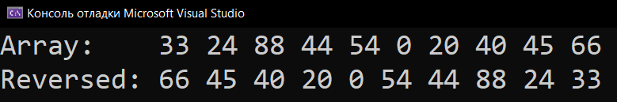
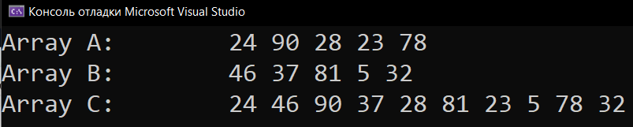
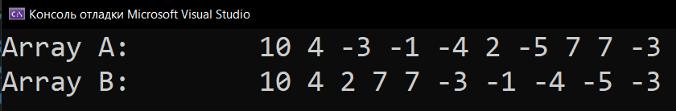

# Homework_16_Arrays
Д/з: Arrays

<a href="https://gist.github.com/SlavikArt/bf3df2084852cb24ed499b875255e05a">Gist - страница со всеми кодами проектов</a>

* [Task_1](Task_1)
* [Task_2](Task_2)
* [Task_3](Task_3)

    <h2>Task 1</h2>
    

    
    <h2>Task 2</h2>
    

    
    <h2>Task 3</h2>
    

    

